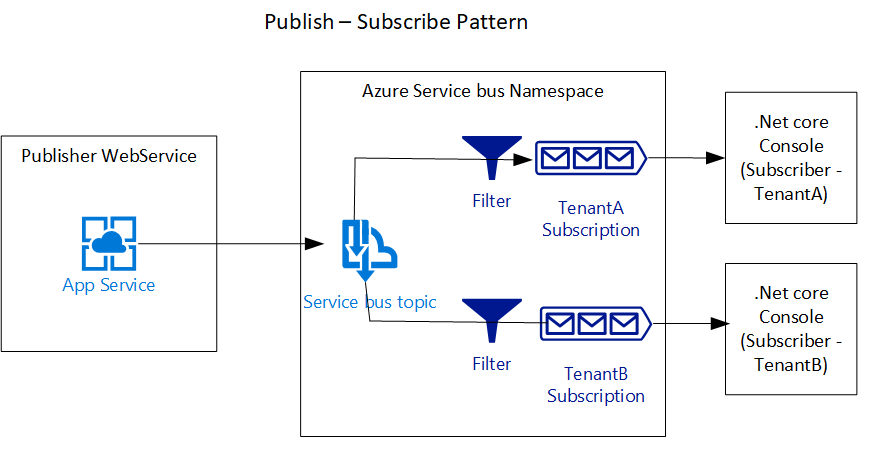

Sample workflow to illustrate Publish-Subscribe pattern.

Solution Overview:
 
Technical environment:
1. Publisher - Web service publishing domain event

		Runtime - .Net Core 2.0
	
		Web Framework- Asp.Net core
	
		Solution: Publisher\Publisher.sln
	
		Unit tests - XUnit with Moq, Autofixture and Fluent assertions

2. Subscriber - Application receiving the domain event

		Runtime - .Net Core 2.0
	
		Solution - Subscriber.sln

	    Note: 
		1. Subscriber.ConsoleApp - .Net core console application subscribed to the domain event. 
		2. Subscriber.AzureFunction - Tried implementing Serverless Azure functions to be the backend event processor but the supporting Azure .Net core Event hub triggers are still in beta.
	
3. Brokered messaging platform - Azure service bus
